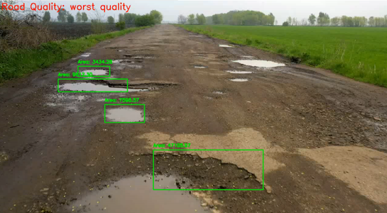
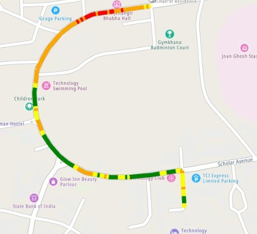

# 👋 Harshit Sharma

**Data Science Student | Machine Learning Enthusiast | Problem Solver**

📍 Gurugram, Haryana, India  
📧 harshitsharma182021@gmail.com  
📱 +91 9306773143  
[LinkedIn](https://linkedin.com/in/harshitsharma-dev)

---

## 📝 Summary

As a passionate data science student, I leverage technology to solve real-world problems. My experience includes impactful projects and internships at IIT Kharagpur, IIT Madras, and PRL ISRO. I enjoy working on innovative projects that drive change and make a positive impact.

---

## 💼 Experience

### Machine Learning Intern, IIT Kharagpur
https://github.com/harshitsharma-dev/PotholeMapping

**May 2024 - Present (2.5 months)**

- Predicted pedestrian safety scores using Computer Vision and Machine Learning.
- Developed models with OpenCV, pandas, and TensorFlow.
- Plotted a map with detected potholes on a Flask-based website, providing insights into pedestrian safety.

### UHI Monitoring Project, IIT Madras
https://github.com/harshitsharma-dev/UrbanHeat

- Used Google Earth Engine (GEE) and machine learning to predict Urban Heat Island (UHI) values.
- Gathered LST and urban morphology data for accurate UHI predictions.
- Developed a user-friendly web application for seamless access to spatial analysis results.

### Buoyant Ascension Project, PRL ISRO
https://colab.research.google.com/drive/1wod0IAOcfi3J1Z-qQomrAlz3rR1FRnEH?usp=sharing
**Feb 2024**

- Presented and led a project to probe gaseous planets at the International Conference on Planets, Exoplanets, and Habitability.
- Used controlled volume expansion simulations and data analysis, reducing data processing time by 50%.

### E-commerce Website Development, VIT

- Created an E-commerce website using React JS and Express JS.
- Developed a Random Forest Classifier to classify customer budgets, enhancing the site's functionality and learning key industry skills.

---

## 🎓 Education

**Vellore Institute of Technology**  
*Bachelor of Technology - BTech, Computer Science*  
Sep 2022 - Apr 2026

**Vidya Mandir Public School**  
*12th, CBSE*  
Apr 2021 - Apr 2022

**Vidya Mandir Public School**  
*10th, CBSE*  
Apr 2019 - Apr 2020

---

## 📜 Licenses & Certifications

- **Alpha - Java, Object-Oriented Programming, Data Structures and Algorithms** - Apna College
- **Python for Data Science and Machine Learning Bootcamp** - Udemy
- **Python for Computer Vision with OpenCV and Deep Learning** - Udemy
- **Microsoft Certified: Azure AI Fundamentals** - Microsoft ([verify](https://verify.certiport.com: wb6vc-FahH))
- **DESIGN, PRINT, ITERATE - Prototyping by Additive Manufacturing with Fusion 360** - Autodesk

---

## 🛠 Skills

- Data Analysis
- Machine Learning
- Deep Learning
- Computer Vision
- Python
- Java
- Object-Oriented Programming (OOP)
- Data Structures
- Algorithms
- Computer Network Operations
- Web Development

---

Feel free to connect to discuss innovative projects and opportunities in data science and technology. Let’s drive change and make a positive impact together!

---

